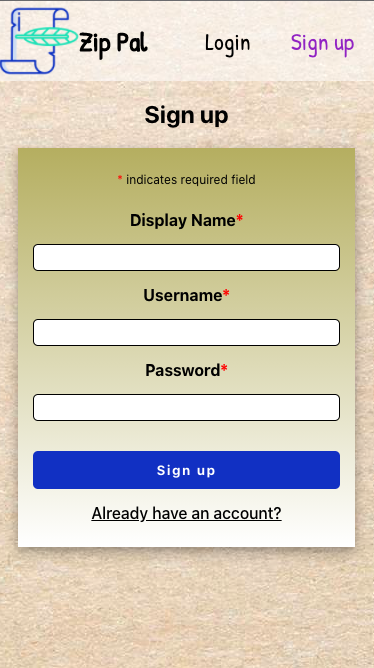
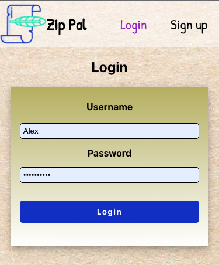
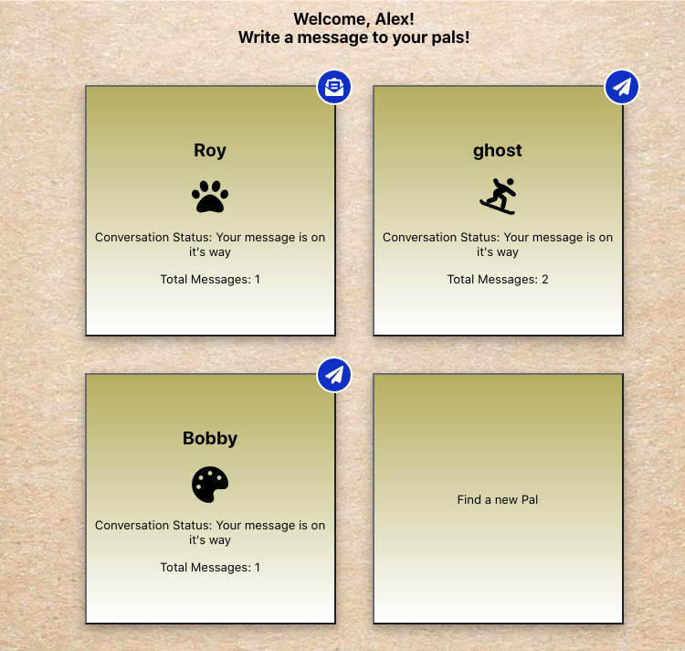
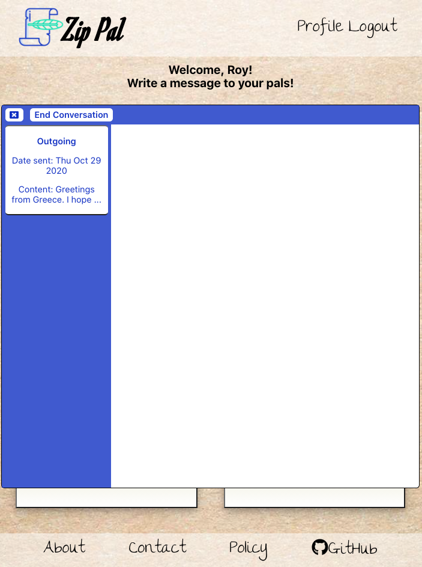
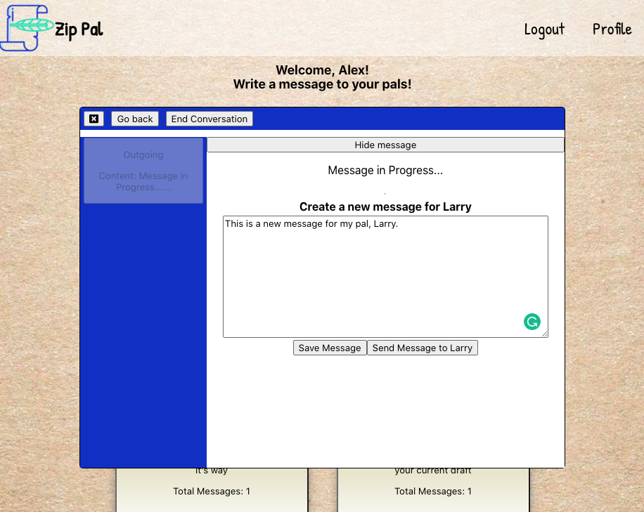
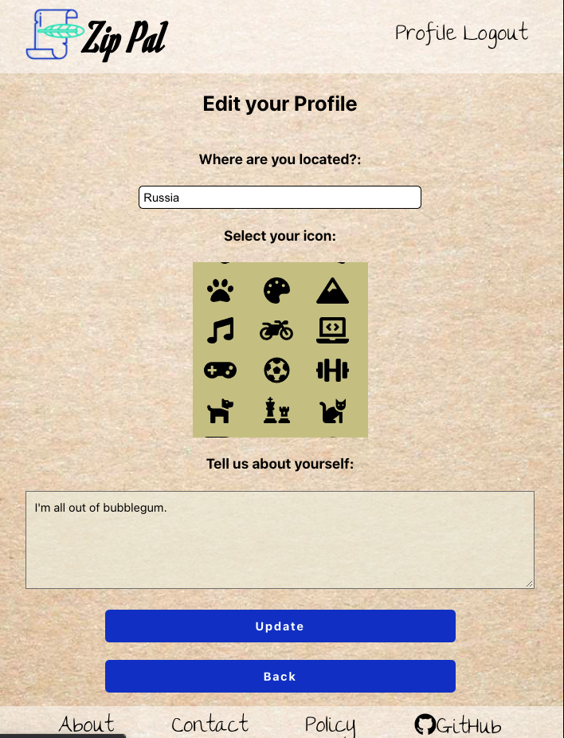

# Zip Pal

## A pen pal app (client side)

[Hosted Live on Vercel](https://zippal.vercel.app/)

Demo User:

username: demo

password: Password0!

[API repo](https://github.com/thinkful-ei-quail/zippal-api)

## Description

In the times of Covid 19 and quarantine, we’ve all experienced isolation. Rush University’s research has shown that chronic social isolation increases the risk of mental health issues like depression, anxiety and substance abuse, as well as raises the risk of dementia in older adults. It can also lead to chronic conditions like high blood pressure, heart disease and diabetes.

Zip Pal was created with the idea of promoting conversation to help alleviate social isolation - and hopefully promote productive discourse in our increasingly polarized world. Zip Pal , using our find-a-pal algorithm, provides 2 random Users (Pals) the opportunity to connect and talk about shared interests or anything they'd like.

When signing up, Users can add their location and a brief bio, this information is useful when Pals are paired with them in a new conversation. When using the find-a-pal feature, Users can start a new conversation with that Pal or find another Pal. Currently, Users can have up to 5 conversations going at one time and they can leave a conversation at any time.

## Tech Stack

- HTML / CSS / JavaScript
- React
- React Router Dom
- JWT Authentication
- Font Awesome
- Jest / Enzyme (testing)

## React Components Codebase:

### Routes:

- "/" --> Homepage (regular route)
- "/login" --> Login page (public only route)
- "/registration" --> New user registration (public only route)
- "/dashboard" --> Main interface for all app functionality (private route)
- "/profile" --> View and edit user location, bio and icon (private route)

### Key Components:

- Header:
  - Viewable in all web pages, serves as the navigation between all other components. Allows user to log in and out.
- Dashboard:
  - The parent component that holds conversations, messages and find a new pal interface.
  - Note, after five minutes of inactivity you will be logged out and redirected to the login screen.
- Conversation Bubbles:
  - There are five conversation slots. Active ones expand into the messaging window. Inactive ones toggle the "find a new pal" window.
  - Icons appear in the corner of each conversation to indicate the status of the last message and who's turn it is.
- Message:
  - This is the interface where incoming and outgoing messages are displayed.
  - When a new conversation is started, the initiator sends the first message.
  - In order to emulate the traditional pen-pal letter sending, users are barred from sending multiple messages in a row and must wait 12 hours before being able to send a response when it is their turn.
  - Messages may be saved as drafts.
- Profile:
  - The profile page is where the user may view and change their location, bio and user icon. All icons in this app are provided by Font-Awesome free svg icons.

## Walk-through with Screenshots

1. First step is to create a new account if you do not have one. You will be directed to the Profile setup page to enter location, bio and choose an icon.

2. If you already have an account proceed straight to the login screen.

3. The dashboard is where you can see an overview of your conversations, your pal's icons, and icons indicating the status of the messaging cycle

4. When you click on a conversation, the messaging interface expands. On the left is the history of your messages. Click on one to bring up the message and if it is your turn, the text editor to respond. There is a button to end the conversation, which will delete all messages for both users.

5. When it is your turn you may draft a message. Save it if you are not ready to send. Send it when you are ready. Remember, the pen-pal system is supposed to be a long-form letter sending experience so take your time and be thoughtful.

6. If you wish to change your profile information, do so here in the edit profile section.

## Instructions to Clone:

1. Clone the client from [Github](https://github.com/thinkful-ei-quail/zippal-client)
2. Clone the server/api from [Github](https://github.com/thinkful-ei-quail/zippal-api)
3. Set up your postgres database and run npm migrate in the api directory
4. Make sure your .env file is set up with proper variable names to connect to the specifications of your port, database variables and JWT secret (this file will not be included in the github repo.)
5. Run `npm run dev` or `npm start` for the api back-end code
6. Run `npm start` to open the client-side app

## Available Scripts

In the project directory, you can run:

### `npm start`

Runs the app in the development mode. 
Open [http://localhost:3000](http://localhost:3000) to view it in the browser.

The page will reload if you make edits. 
You will also see any lint errors in the console.

### `npm test`

Launches the test runner in the interactive watch mode. 
See the section about [running tests](https://facebook.github.io/create-react-app/docs/running-tests) for more information.

### `npm run build`

Builds the app for production to the `build` folder. 
It correctly bundles React in production mode and optimizes the build for the best performance.

The build is minified and the filenames include the hashes. 
Your app is ready to be deployed!

See the section about [deployment](https://facebook.github.io/create-react-app/docs/deployment) for more information.

### `npm run eject`

**Note: this is a one-way operation. Once you `eject`, you can’t go back!**

If you aren’t satisfied with the build tool and configuration choices, you can `eject` at any time. This command will remove the single build dependency from your project.

Instead, it will copy all the configuration files and the transitive dependencies (webpack, Babel, ESLint, etc) right into your project so you have full control over them. All of the commands except `eject` will still work, but they will point to the copied scripts so you can tweak them. At this point you’re on your own.

You don’t have to ever use `eject`. The curated feature set is suitable for small and middle deployments, and you shouldn’t feel obligated to use this feature. However we understand that this tool wouldn’t be useful if you couldn’t customize it when you are ready for it.
